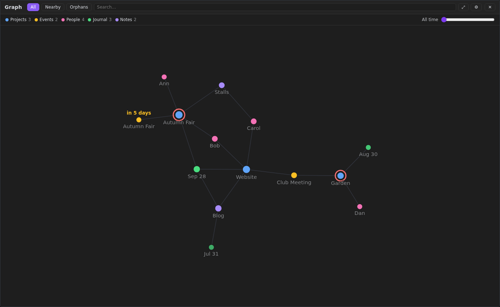
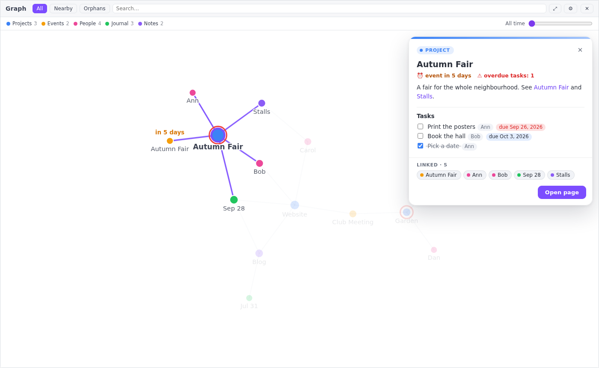

# Constellation — a living graph view for SilverBullet

[Русская версия](README.ru.md)

Constellation shows your [SilverBullet](https://silverbullet.md) space as a graph that feels alive: nodes gently
drift, neighbours follow a node you drag, the rest make room — and yet the layout never jumps. It stays exactly
where you left it between openings and page switches.

Click a node and a card opens with the page itself: text, queries, widgets, and **task checkboxes that actually
work**. You can tick off tasks without leaving the graph.





## Features

- **Two views**: full screen (**Constellation: Open Graph**) and a side panel next to the page
  (**Constellation: Toggle Side Graph**).
- **Groups with colors**: a legend that doubles as a filter. Configure groups by folder, or let Constellation make one
  group per top-level folder.
- **A page card**: rendered content, `${…}` queries and widgets, linked pages, and an **Open page** button.
  **Task checkboxes write straight into the page**, including tasks shown by queries from other pages.
- **Timeline**: a slider shows only pages from the last N days. Recent pages are brighter, older ones fade.
- **Marks**: a red ring on pages with overdue tasks, and “in N days” on upcoming events.
- **Links from task attributes**: `[who: Ann]` can link the page to `People/Ann`, so people are not orphans.
- **Constellations**: pages about the same thing gather and glow like nebulae, each with its own color and a name
  (click the name to zoom in, hover it to highlight the pages). Long names wrap into a few lines, and names push
  each other apart so they do not pile up. They are found from the links between pages *and* from
  the similarity of their texts (TF-IDF, computed in the browser and remembered until a page changes). Day and week
  summaries are left out: they link everything with everything. Optional thin threads show pages that are alike but
  not linked.
- **Nearby** mode (one to three steps around the selected page), search, orphans on demand.
- **Settings panel** (⚙):
  - motion: drift, calm, or still; repulsion, link length, pull to the center;
  - constellations: nebulae on/off, brightness, softness of the edges, color (own or by group), names, links ↔ text
    balance, strictness, size, smallest constellation, how strongly they gather, similarity threads;
  - nodes as dots or as **stars** — a white-hot core, a glow of the group color and rays, bigger for pages with
    more links (glow, rays and core are adjustable);
  - node size (by links or equal), link width and brightness, starry background (with adjustable brightness), twinkling out of step, dimming on hover;
  - labels: which to show, brightness, size, and font (plain, serif, narrow, mono, rounded, Roboto, Verdana, Trebuchet, Palatino, or the SilverBullet one);
  - group colors, timeline brightness, marks, and opening on start.
- **Hide a page**: right click a node — it disappears from the graph and the constellations (undo in the note, restore in Settings). Handy for hub pages that glue everything together.
- English and Russian interface; light and dark theme (follows SilverBullet on the fly); touch friendly.
- Several spaces on one server (multi-user SilverBullet) each keep their own layout.

## Install

In SilverBullet run **Library: Install** and enter:

```
ghr:TeenKode/silverbullet-constellation/PLUG.md
```

This takes the latest [release](https://github.com/TeenKode/silverbullet-constellation/releases). Update later with
**Library: Update**. To follow the `main` branch instead, use `github:TeenKode/silverbullet-constellation/PLUG.md`.

Manual install: put `constellation.plug.js` anywhere in your space (for example `Library/TeenKode/`) and run
**Plugs: Reload**.

Requires SilverBullet 2.10 or newer. It is checked on every change against SilverBullet 2.11.1.

## Use

| | |
|---|---|
| **Constellation: Open Graph** | full-screen graph; run again or press Esc to close |
| **Constellation: Toggle Side Graph** | graph next to the page; clicking a node navigates |
| Click a node (full screen) | opens the page card |
| Hover a link in the card | highlights that page in the graph |
| Esc | clears search, then closes settings, the card, and the graph |

A button for your action bar (in a `space-lua` block):

```lua
actionButton.define {
  icon = "share-2",
  description = "Graph",
  run = function() editor.invokeCommand("Constellation: Open Graph") end,
}
```

## Configuration

Everything is optional. Put the configuration in a `space-lua` block, for example on your `CONFIG` page:

```lua
config.set("constellation", {
  language = "auto",
  openOnStart = false,
  groups = {
    { id = "project", name = "Projects", one = "Project", prefix = "Projects/" },
    { id = "event",   name = "Events",   one = "Event",   prefix = "Events/" },
    { id = "person",  name = "People",   one = "Person",  prefix = "People/", undated = true },
    { id = "journal", name = "Journal",  prefix = "Journal/", color = "#22c55e", darkColor = "#4ade80" },
    { id = "other",   name = "Notes",    one = "Note" },
    { id = "meta",    name = "Meta",     pages = { "index" }, hidden = true, undated = true },
  },
  taskLinks = { who = "People/" },
  dueAttributes = { "due", "deadline" },
  upcoming = { attribute = "date", days = 14, prefix = "Events/", mirror = "Projects/" },
})
```

| Key | Default | Meaning |
|---|---|---|
| `language` | `"auto"` | `"en"`, `"ru"`, or `"auto"` (browser language) |
| `openOnStart` | `false` | open the full-screen graph when the space opens on the start page; each browser can change it in ⚙ |
| `startPage` | `"index"` | the start page (for `openOnStart` and the “Home” label) |
| `homeLabel` | `"Home"` | label of the start page node |
| `groups` | one per top-level folder | ordered list, first match wins. `prefix` is a string or list; `pages` lists exact names. `color`/`darkColor` set the colors, `hidden` hides a group by default, and `undated` keeps it out of the timeline. Pages matching no group go to `other`; add `{ id = "other", … }` to name it or place it in the legend. |
| `taskLinks` | `{}` | task attribute → page prefix. `[who: Ann, Bob]` links the task's page to `People/Ann` and `People/Bob`. |
| `dueAttributes` | `{"due", "deadline"}` | task attributes holding a due date (`YYYY-MM-DD`) for the overdue ring |
| `upcoming` | `{attribute = "date", days = 14}` | pages whose `attribute` date is within `days` get “in N days”. `prefix` limits the mark to a folder; `mirror` also marks the page with the same name under another prefix (an event's project). Use `false` to switch it off. |
| `exclude` | — | more pages to hide: `"Folder/"` prefixes or exact names. `Library/`, `Repositories/`, `_…`, `CONFIG`, `PLUGS`, `SETTINGS` and `SECRETS` are always hidden. |
| `noConstellations` | — | pages that stay on the graph but never belong to a constellation (an index of everything, a “similar topics” page): `"Folder/"` prefixes or exact names. Pages that glue several topics are also found automatically (⚙ → “Hubs stay out”). |
| `similarity` | `true` | read page texts to find pages about the same thing (constellations). `false` — links only; texts are never read. |
| `similarityMaxPages` | `1500` | with more pages than this the texts are not read |
| `extraCss` | `""` | extra CSS for the graph panel, for example styles of your own widgets shown in the card |

Timeline dates: a page named by a date (`Journal/2026-09-28`) uses that day. A page named by an ISO week
(`Weekly/2026-W39`) uses the Monday of that week. Other pages use their last modification.

Per-browser settings (⚙, legend filters, the timeline) are kept in the browser. **Reset settings** in ⚙ restores
the defaults.

## Development

```shell
npm install
npm test                 # unit tests (node --test)
npm run build            # → constellation.plug.js
node scripts/check.mjs   # end-to-end check in a real SilverBullet with Playwright
```

`scripts/check.mjs` downloads SilverBullet (`SB_VERSION`, default 2.11.1) or uses `SB_BIN`, and builds a demo space
(`scripts/demo-space.mjs`). `CHROME_BIN` selects a Chromium, and `SCREENSHOTS=docs` refreshes the README images.

- `src/core.ts` is pure logic: configuration, labels, task positions, and graph data.
- `src/constellation.ts` holds the plug functions.
- `assets/graph-render.js` is the renderer: d3 inside the panel iframe.

Releases: bump `version` in `package.json`, then push a tag `v<version>`, or run the **Release** workflow with
“release” checked. The workflow tests, builds, and checks the plug, then publishes `constellation.plug.js` and
`PLUG.md`.

## Credits and license

MIT, see [LICENSE](LICENSE). Based on [Atlas](https://github.com/selcux/silverbullet-atlas) by Selçuk Öztürk (MIT).
Uses [d3](https://d3js.org) (ISC).
